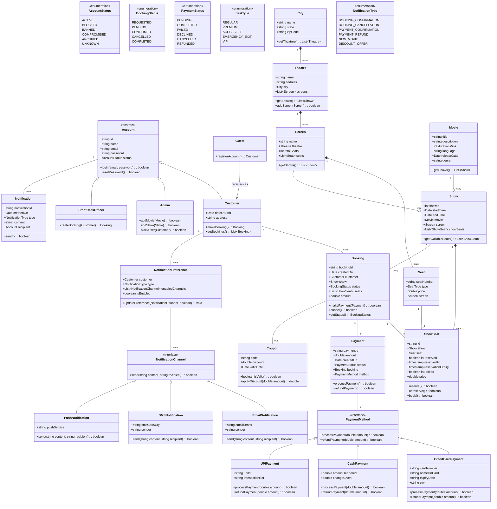

# Movie-Ticket-Booking

A comprehensive object-oriented movie ticket booking management system built with TypeScript that simulates a movie ticket booking within various cities, theatres, screens and payment strategies.

## 🎮 Features

## 📋 Requirements

### Functional Requirements

### Non-Functional Requirements

## 🏗️ Architecture

### Class Structure

## 🧠 Design Patterns Used

## 🧩 Key Learnings

## 💻 Technical Skills Gained

- TypeScript advanced features (classes, interfaces, enums, generics)
- Object-oriented programming principles
- Test-driven development with Jest
- Design patterns implementation
- Domain modeling
- Building extensible software systems

## Diagram



## 🛠️ Technology Stack

- TypeScript
- Node.js
- Jest (for testing)

## 📋 Prerequisites

- Node.js (v14.0.0 or higher)
- npm or yarn

## ⚙️ Installation

1. Clone the repository:

   ```bash
   git clone https://github.com/kashaf12/LLD-in-Typescript.git
   cd Movie-Ticket-Booking
   ```

2. Install dependencies:

   ```bash
   npm install
   ```

3. Build the project:
   ```bash
   npm run build
   ```

## 🚀 Running the Project

Run the project with the following command:

```bash
npm run start
```

This will start a simulation of the parking lot system with vehicles entering and exiting, payments being processed, and other operations.

## 🧪 Running Tests

Run the test suite with:

```bash
npm test
```

## 🛣️ Future Enhancements

## 📜 License

MIT

## 👥 Contributing

Contributions are welcome! Please feel free to submit a Pull Request.

1. Fork the repository
2. Create your feature branch (`git checkout -b feature/amazing-feature`)
3. Commit your changes (`git commit -m 'Add some amazing feature'`)
4. Push to the branch (`git push origin feature/amazing-feature`)
5. Open a Pull Request
