# Parking-Lot-System

A comprehensive object-oriented parking lot management system built with TypeScript that simulates a multi-level parking lot with various vehicle types, parking spots, and payment strategies.

## 🎮 Features

- Multiple parking floors with various types of parking spots
- Support for different vehicle types (Car, Truck, Van, Motorbike, Electric)
- Specialized parking spots (Compact, Large, Handicapped, Motorbike, Electric with charging stations)
- Entry and exit panel systems for parking operations
- Dynamic pricing strategies (Hourly, Flat Rate, Day/Night)
- Multiple payment methods (Cash, Credit Card, UPI)
- Electric vehicle charging support
- Real-time parking availability display
- Admin and attendant management portals

## 📋 Requirements

### Functional Requirements

- The system should support multiple parking floors
- The system should support multiple entry and exit points
- The system should support different types of vehicles and parking spots
- Customers should be able to collect a parking ticket at entry and pay at exit
- The system should calculate parking fees based on vehicle type and duration
- The system should support different pricing models
- The system should support multiple payment methods
- Electric vehicle charging stations should be available
- The system should provide real-time information about available parking spots
- Admin users should be able to add/modify/remove parking floors, spots, etc.

### Non-Functional Requirements

- The system should be scalable to handle a growing number of vehicles and parking spots
- The system should be available 24/7 with minimal downtime
- Payment processing should be secure and reliable
- The system should provide accurate information about parking availability
- The system should handle concurrent entry/exit operations efficiently

## 🏗️ Architecture

### Class Structure

The system follows Object-Oriented Design principles with the following main components:

1. **Core Components**

   - `ParkingLot`: Manages the overall parking system
   - `ParkingFloor`: Represents individual parking floors
   - `ParkingSpot`: Abstract base class for different types of parking spots

2. **Spots**

   - `CompactSpot`, `LargeSpot`, `HandicappedSpot`, `MotorbikeSpot`, `ElectricSpot`

3. **Vehicles**

   - `Vehicle`: Abstract base class for all vehicles
   - `Car`, `Truck`, `Van`, `MotorBike`, `Electric`

4. **UI and Interaction**

   - `EntryPanel`: Handles vehicle entry and ticket issuance
   - `ExitPanel`: Handles payment processing and vehicle exit
   - `ParkingDisplayBoard`: Shows available parking spots
   - `CustomerInfoPanel`: Provides information to customers
   - `ElectricPanel`: Manages electric vehicle charging

5. **Payment System**

   - `ParkingTicket`: Records parking details and status
   - `Payment`: Handles payment information
   - `ParkingAttendantPortal`: Interface for parking attendants

6. **Strategies (Design Patterns)**

   - `SpotAssignmentStrategy`: For assigning parking spots
   - `PricingStrategy`: For calculating parking fees
   - `PaymentStrategy`: For processing different payment methods

7. **Users**
   - `Account`: Base class for system users
   - `Admin`: For system administration
   - `ParkingAttendant`: For managing parking operations

## 🧠 Design Patterns Used

- **Factory Pattern**: `ParkingSpotFactory` and `VehicleFactory` for creating objects
- **Strategy Pattern**: For interchangeable algorithms (pricing, payment, spot assignment)
- **Singleton Pattern**: For managing system-wide components
- **Abstract Factory Pattern**: For creating families of related objects
- **Observer Pattern**: For updating displays when parking availability changes
- **Command Pattern**: For encapsulating operations

## 🧩 Key Learnings

- Object-oriented design principles in a real-world application
- Applying design patterns to solve specific problems
- Modeling complex business domains with classes and interfaces
- Building extensible and maintainable software architecture
- Implementing polymorphism through interfaces and abstract classes
- Managing complex state transitions in a system

## 💻 Technical Skills Gained

- TypeScript advanced features (classes, interfaces, enums, generics)
- Object-oriented programming principles
- Test-driven development with Jest
- Design patterns implementation
- Domain modeling
- Building extensible software systems

## Diagram

```mermaid
classDiagram
    %% Core Classes
    class ParkingLot {
        -String name
        -Address address
        -List~ParkingFloor~ floors
        -List~EntryPanel~ entryPanels
        -List~ExitPanel~ exitPanels
        -PricingStrategy pricingStrategy
        -SpotAssignmentStrategy spotAssignmentStrategy
        -int capacity
        +getName() String
        +getAddress() Address
        +getPricingStrategy() PricingStrategy
        +setSpotAssignmentStrategy(SpotAssignmentStrategy)
        +isParkingFull() bool
        +getAvailableSpot(VehicleType) ParkingSpot
        +updateDisplayBoards()
        +addFloor(ParkingFloor)
        +removeFloor(ParkingFloor)
    }

    class ParkingFloor {
        -String name
        -List~ParkingSpot~ parkingSpots
        -ParkingDisplayBoard displayBoard
        -CustomerInfoPanel infoPanel
        -int capacity
        -int availableSpots
        +getName() String
        +getAvailableSpots() int
        +isParkingFull() bool
        +updateDisplayBoard()
        +addParkingSpot(ParkingSpot)
        +assignVehicle(Vehicle, ParkingSpot)
        +freeSpot(ParkingSpot)
        +getAvailableSpotsByType(VehicleType) List~ParkingSpot~
        +getAvailableSpot(VehicleType, SpotAssignmentStrategy) ParkingSpot
    }

    class ParkingSpot {
        <<abstract>>
        -String number
        -boolean isOccupied
        -ParkingSpotType type
        -Vehicle vehicle
        +getNumber() String
        +getType() ParkingSpotType
        +isSpotOccupied() bool
        +assignVehicle(Vehicle) bool
        +removeVehicle() bool
    }

    %% ParkingSpot subclasses
    class CompactSpot {
    }
    class LargeSpot {
    }
    class HandicappedSpot {
    }
    class MotorBikeSpot {
    }
    class ElectricSpot {
        -ElectricPanel chargingPanel
        +setChargingPanel(ElectricPanel)
        +hasChargingPanel() bool
        +getChargingStatus() PaymentStatus
        +startCharging() bool
        +stopCharging() bool
    }

    %% Vehicles
    class Vehicle {
        <<abstract>>
        -String licenseNumber
        -VehicleType type
        -ParkingTicket ticket
        +assignTicket(ParkingTicket)
        +getTicket() ParkingTicket
        +getLicenseNumber() String
        +getType() VehicleType
    }

    class Car {
    }
    class Truck {
    }
    class Van {
    }
    class MotorBike {
    }
    class Electric {
    }

    %% Panels and Displays
    class EntryPanel {
        -String id
        -ParkingLot parkingLot
        -int ticketCounter
        +getId() String
        +isParkingFull() bool
        +displayMessage(String)
        +printTicket(Vehicle) ParkingTicket
    }

    class ExitPanel {
        -String id
        -ParkingLot parkingLot
        +getId() String
        +scanTicket(ParkingTicket) double
        +processPayment(ParkingTicket, Payment) bool
        +displayMessage(String)
    }

    class ParkingDisplayBoard {
        -String id
        -Map~ParkingSpotType, int~ availableSpotCount
        +showAvailableSpots() Map
        +updateAvailableSpots(ParkingSpotType, int)
    }

    class CustomerInfoPanel {
        -String id
        -ParkingFloor floor
        +getId() String
        +showAvailableSpots() Map
        +processPayment(ParkingTicket, Payment) bool
    }

    class ElectricPanel {
        -String id
        -double chargingRate
        -PaymentStatus status
        -DateTime startTime
        -DateTime endTime
        +getId() String
        +getStatus() PaymentStatus
        +startCharging() bool
        +stopCharging() bool
        +calculateChargingFee() double
        +processPayment(Payment) bool
    }

    %% Payment related
    class ParkingTicket {
        -String ticketNumber
        -DateTime issuedAt
        -DateTime payedAt
        -double amount
        -boolean isPaid
        -PaymentStatus paymentStatus
        -ParkingSpot parkingSpot
        -Vehicle vehicle
        +getTicketNumber() String
        +getIssuedTime() DateTime
        +calculateFee(PricingStrategy) double
        +markPaid(DateTime)
        +getPaymentStatus() PaymentStatus
        +getParkingSpot() ParkingSpot
        +getVehicle() Vehicle
        +getDuration() int
    }

    class Payment {
        -double amount
        -DateTime timestamp
        -PaymentStatus status
        -PaymentMethod method
        -PaymentStrategy paymentStrategy
        +getAmount() double
        +getTimestamp() DateTime
        +getStatus() PaymentStatus
        +getMethod() PaymentMethod
        +setPaymentStrategy(PaymentStrategy)
        +processPayment() PaymentStatus
    }

    class ParkingAttendantPortal {
        -String attendantId
        +getAttendantId() String
        +processTicket(ParkingTicket) ParkingTicket
        +processPayment(ParkingTicket, Payment) bool
    }

    %% Strategies
    class SpotAssignmentStrategy {
        <<interface>>
        +findSpot(List~ParkingSpot~, VehicleType) ParkingSpot
    }

    class FirstAvailableStrategy {
        +findSpot(List~ParkingSpot~, VehicleType) ParkingSpot
    }

    class PricingStrategy {
        <<interface>>
        +calculateFee(ParkingTicket) double
        +calculateTax(double) double
        +getTotalFee(ParkingTicket) double
    }

    class HourlyPricingStrategy {
        -double firstHourRate
        -double secondThirdHourRate
        -double subsequentHourRate
        -Map~VehicleType, double~ vehicleTypeSurcharge
        -double taxRate
        +calculateFee(ParkingTicket) double
        +calculateTax(double) double
        +getTotalFee(ParkingTicket) double
    }

    class FlatRatePricingStrategy {
        -double dailyRate
        -Map~VehicleType, double~ vehicleTypeSurcharge
        -double taxRate
        +calculateFee(ParkingTicket) double
        +calculateTax(double) double
        +getTotalFee(ParkingTicket) double
    }

    class DayNightPricingStrategy {
        -double dayRate
        -double nightRate
        -Map~VehicleType, double~ vehicleTypeSurcharge
        -double taxRate
        -int dayStartHour
        -int nightStartHour
        +calculateFee(ParkingTicket) double
        +calculateTax(double) double
        +getTotalFee(ParkingTicket) double
    }

    class PaymentStrategy {
        <<interface>>
        +processPayment(double) PaymentStatus
    }

    class CashPaymentStrategy {
        +processPayment(double) PaymentStatus
    }

    class CreditCardPaymentStrategy {
        -String gatewayUrl
        +processPayment(double) PaymentStatus
        +connectToGateway() bool
    }

    class UPIPaymentStrategy {
        -String merchantId
        -String apiKey
        +processPayment(double) PaymentStatus
    }

    %% User accounts
    class Account {
        <<abstract>>
        -String username
        -String password
        -AccountType accountType
        +resetPassword(String) bool
        +getAccountType() AccountType
    }

    class Admin {
        +addParkingFloor(ParkingLot, ParkingFloor) bool
        +addParkingSpot(ParkingLot, String, ParkingSpot)
        +addEntrancePanel(ParkingLot, EntryPanel) bool
        +addExitPanel(ParkingLot, ExitPanel) bool
    }

    class ParkingAttendant {
        +processTicket() bool
    }

    %% Enums
    class VehicleType {
        <<enumeration>>
        CAR
        TRUCK
        VAN
        MOTORBIKE
        ELECTRIC
    }

    class ParkingSpotType {
        <<enumeration>>
        HANDICAPPED
        COMPACT
        LARGE
        MOTORBIKE
        ELECTRIC
    }

    class PaymentMethod {
        <<enumeration>>
        CASH
        CREDIT_CARD
        UPI
    }

    class AccountType {
        <<enumeration>>
        ADMIN
        ATTENDANT
        CUSTOMER
    }

    class PaymentStatus {
        <<enumeration>>
        UNPAID
        PENDING
        COMPLETED
        FAILED
        REFUNDED
    }

    %% Other models
    class Address {
        -String street
        -String city
        -String state
        -String zipCode
        -String country
        +getFullAddress() String
    }

    %% Factory classes
    class ParkingSpotFactory {
        +createParkingSpot(String, ParkingSpotType, bool) ParkingSpot
    }

    class VehicleFactory {
        +createVehicle(String, VehicleType) Vehicle
    }

    %% Relationships
    ParkingLot "1" --* "*" ParkingFloor : has
    ParkingLot "1" --* "*" EntryPanel : has
    ParkingLot "1" --* "*" ExitPanel : has
    ParkingLot "1" --o "1" PricingStrategy : uses
    ParkingLot "1" --o "1" SpotAssignmentStrategy : uses
    ParkingLot "1" --o "1" Address : has

    ParkingFloor "1" --* "*" ParkingSpot : contains
    ParkingFloor "1" --* "1" ParkingDisplayBoard : has
    ParkingFloor "1" --* "1" CustomerInfoPanel : has

    ParkingSpot <|-- CompactSpot : extends
    ParkingSpot <|-- LargeSpot : extends
    ParkingSpot <|-- HandicappedSpot : extends
    ParkingSpot <|-- MotorBikeSpot : extends
    ParkingSpot <|-- ElectricSpot : extends

    Vehicle <|-- Car : extends
    Vehicle <|-- Truck : extends
    Vehicle <|-- Van : extends
    Vehicle <|-- MotorBike : extends
    Vehicle <|-- Electric : extends

    ElectricSpot "1" --* "1" ElectricPanel : has

    ParkingTicket "1" --o "1" ParkingSpot : for
    ParkingTicket "1" --o "1" Vehicle : assigned to
    ParkingTicket "1" --o "1" Payment : paid via

    Payment "1" --o "1" PaymentStrategy : uses

    SpotAssignmentStrategy <|-- FirstAvailableStrategy : implements

    PricingStrategy <|-- HourlyPricingStrategy : implements
    PricingStrategy <|-- FlatRatePricingStrategy : implements
    PricingStrategy <|-- DayNightPricingStrategy : implements

    PaymentStrategy <|-- CashPaymentStrategy : implements
    PaymentStrategy <|-- CreditCardPaymentStrategy : implements
    PaymentStrategy <|-- UPIPaymentStrategy : implements

    Account <|-- Admin : extends
    Account <|-- ParkingAttendant : extends
```



## 🛠️ Technology Stack

- TypeScript
- Node.js
- Jest (for testing)

## 📋 Prerequisites

- Node.js (v14.0.0 or higher)
- npm or yarn

## ⚙️ Installation

1. Clone the repository:

   ```bash
   git clone https://github.com/kashaf12/LLD-in-Typescript.git
   cd Parking-Lot-System
   ```

2. Install dependencies:

   ```bash
   npm install
   ```

3. Build the project:
   ```bash
   npm run build
   ```

## 🚀 Running the Project

Run the project with the following command:

```bash
npm run start
```

This will start a simulation of the parking lot system with vehicles entering and exiting, payments being processed, and other operations.

## 🧪 Running Tests

Run the test suite with:

```bash
npm test
```

## 🛣️ Future Enhancements

- Mobile application for customers to reserve spots and pay remotely
- Integration with license plate recognition systems
- Smart parking guidance system
- Monthly/yearly subscription models for regular customers
- Analytics dashboard for parking usage patterns
- Integration with smart city infrastructure
- Automated vehicle dispatch for valet parking
- Dynamic pricing based on demand and time of day

## 📜 License

MIT

## 👥 Contributing

Contributions are welcome! Please feel free to submit a Pull Request.

1. Fork the repository
2. Create your feature branch (`git checkout -b feature/amazing-feature`)
3. Commit your changes (`git commit -m 'Add some amazing feature'`)
4. Push to the branch (`git push origin feature/amazing-feature`)
5. Open a Pull Request
