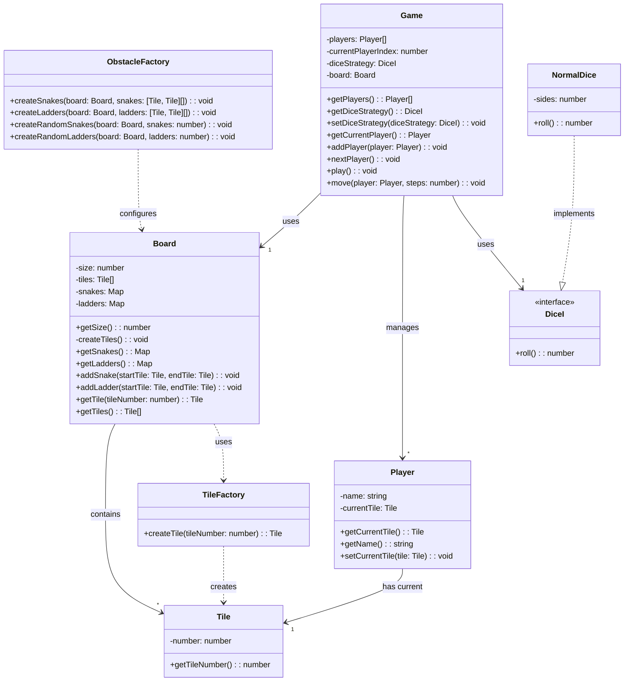

# Snake & Ladder Game

A command-line implementation of the classic Snake & Ladder game built with TypeScript using object-oriented programming principles and design patterns.

## 🎮 Features

- Classic Snake and Ladder gameplay
- Configurable board size
- Random generation of snakes and ladders
- Support for multiple players
- Extensible dice rolling strategy
- Command-line interface

## 📋 Requirements

### Functional Requirements

- Players roll a dice to move their token across the board
- The board consists of numbered tiles from 1 to N (where N is configurable)
- Snakes move a player from a higher position to a lower position
- Ladders move a player from a lower position to a higher position
- Players take turns rolling and moving
- The first player to reach the final tile wins
- A player must roll the exact number to reach the final tile

### Non-Functional Requirements

- Maintainable and extensible code using OOP principles
- Testable components with unit tests
- Configurable board size, number of snakes, and ladders
- Support for custom dice rolling strategies

## 🏗️ Architecture

The game follows a clean object-oriented design with clear separation of concerns:

### Class Structure

- **Game**: Manages game state, player turns, and game flow
- **Board**: Represents the game board with tiles, snakes, and ladders
- **Player**: Represents a player with a current position on the board
- **Tile**: Represents a single position on the board
- **TileFactory**: Creates tiles with specific positions
- **ObstacleFactory**: Creates snakes and ladders on the board
- **Dice**: Interface for dice rolling strategies
- **NormalDice**: Standard dice implementation

## Diagram



## 🛠️ Technology Stack

- TypeScript
- Node.js
- Jest (for testing)

## 📋 Prerequisites

- Node.js (v14.0.0 or higher)
- npm or yarn

## ⚙️ Installation

1. Clone the repository:

   ```bash
   git clone https://github.com/kashaf12/LLD.git
   cd Snake-Ladder
   ```

2. Install dependencies:

   ```bash
   npm install
   ```

3. Build the project:
   ```bash
   npm run build
   ```

## 🚀 Running the Game

Run the game with the following command:

```bash
npm run start
```

The game will start with the default configuration:

- 100 tiles board
- 5 random snakes
- 5 random ladders
- 2 players
- 6-sided dice

## 🧪 Running Tests

Run the test suite with:

```bash
npm test
```

## 🛣️ Future Enhancements

- Add a graphical user interface
- Implement different board layouts
- Add special tiles with unique effects
- Support for network multiplayer
- Add game statistics and leaderboards
- Implement different game modes

## 🧠 Design Patterns Used

- **Factory Pattern**: TileFactory and ObstacleFactory for creating objects
- **Strategy Pattern**: DiceI interface allows for different dice rolling strategies
- **Composite Pattern**: Board contains tiles, snakes, and ladders

## 📜 License

MIT

## 👥 Contributing

Contributions are welcome! Please feel free to submit a Pull Request.

1. Fork the repository
2. Create your feature branch (`git checkout -b feature/amazing-feature`)
3. Commit your changes (`git commit -m 'Add some amazing feature'`)
4. Push to the branch (`git push origin feature/amazing-feature`)
5. Open a Pull Request
