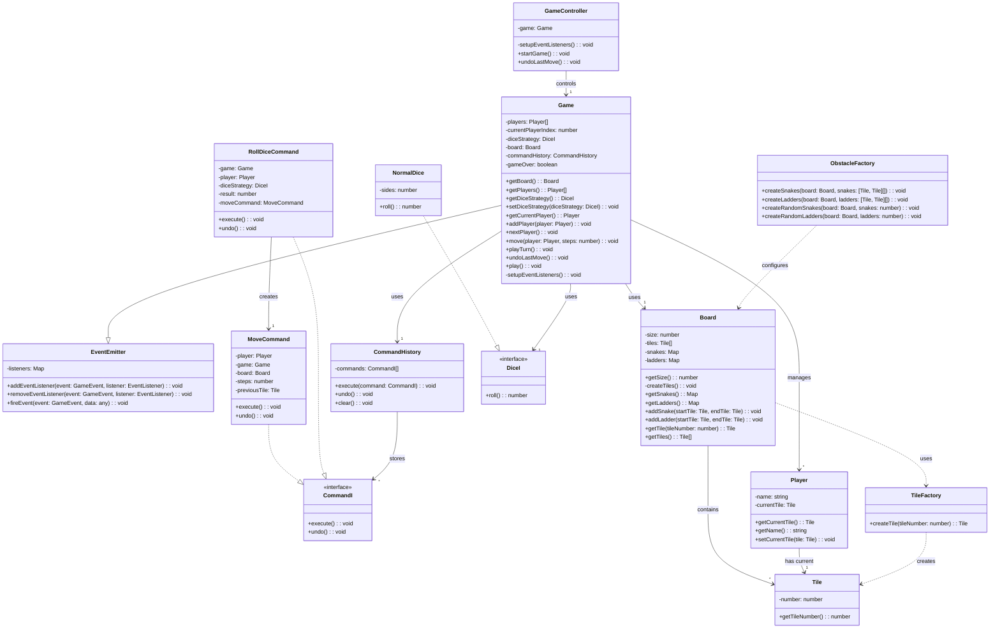

# Snake & Ladder Game

A command-line implementation of the classic Snake & Ladder game built with TypeScript using object-oriented programming principles and design patterns.

## 🎮 Features

- Classic Snake and Ladder gameplay
- Configurable board size
- Random generation of snakes and ladders
- Support for multiple players
- Extensible dice rolling strategy
- Command-line interface
- Event-driven architecture
- Command pattern for move history and undo functionality

## 📋 Requirements

### Functional Requirements

- Players roll a dice to move their token across the board
- The board consists of numbered tiles from 1 to N (where N is configurable)
- Snakes move a player from a higher position to a lower position
- Ladders move a player from a lower position to a higher position
- Players take turns rolling and moving
- The first player to reach the final tile wins
- A player must roll the exact number to reach the final tile
- Players can undo their last move

### Non-Functional Requirements

- Maintainable and extensible code using OOP principles
- Testable components with unit tests
- Configurable board size, number of snakes, and ladders
- Support for custom dice rolling strategies
- Event-driven communication between components

## 🏗️ Architecture

The game follows a clean object-oriented design with clear separation of concerns:

### Class Structure

- **Game**: Manages game state, player turns, and game flow
- **Board**: Represents the game board with tiles, snakes, and ladders
- **Player**: Represents a player with a current position on the board
- **Tile**: Represents a single position on the board
- **TileFactory**: Creates tiles with specific positions
- **ObstacleFactory**: Creates snakes and ladders on the board
- **Dice**: Interface for dice rolling strategies
- **NormalDice**: Standard dice implementation
- **EventEmitter**: Enables event-driven communication
- **CommandHistory**: Maintains history of player moves
- **Command Interface**: Defines execute and undo operations
- **MoveCommand**: Implements player movement with undo capability
- **RollCommand**: Implements dice rolling with undo capability
- **GameController**: Controls game flow and UI interactions

## 🧠 Design Patterns Used

1. **Factory Pattern**:

   - **TileFactory**: Creates tile objects, encapsulating the creation logic
   - **ObstacleFactory**: Creates snakes and ladders, handling complex creation rules

2. **Strategy Pattern**:

   - **DiceI interface**: Allows for swappable dice rolling implementations
   - Enables easy extension with specialized dice (biased dice, loaded dice, etc.)

3. **Command Pattern**:

   - **CommandI interface**: Defines the execute and undo operations
   - **MoveCommand**: Encapsulates player movement with ability to undo
   - **RollDiceCommand**: Encapsulates dice rolling with ability to undo
   - **CommandHistory**: Maintains the history of commands for undo functionality

4. **Observer Pattern**:

   - **EventEmitter**: Implements publish/subscribe mechanism
   - Game components communicate via events rather than direct method calls
   - Decouples game logic from UI updates

5. **Composite Pattern**:

   - Board contains tiles, snakes, and ladders in a tree-like structure

6. **MVC Pattern**:
   - **Model**: Game, Board, Player classes
   - **View**: Console output (implicit in current implementation)
   - **Controller**: GameController class

## 🧩 Key Learnings

1. **Event-Driven Architecture**:

   - Using events for communication between components reduces coupling
   - Makes the system more extensible and testable
   - Simplifies adding new features without modifying existing code

2. **Command Pattern Benefits**:

   - Enables undo/redo functionality
   - Encapsulates operations as objects
   - Separates the requester from the executor

3. **Test-Driven Development**:

   - Tests verify component behavior in isolation
   - Ensures system reliability as new features are added
   - Provides documentation of expected behavior

4. **Separation of Concerns**:

   - Each class has a single responsibility
   - Changes to one component minimally impact others
   - Easier to understand, maintain, and extend

5. **Type Safety in TypeScript**:
   - Interfaces ensure type safety across the codebase
   - Compiler catches potential errors at compile time
   - Better developer experience with IDE support

## 💻 Technical Skills Gained

1. **TypeScript Proficiency**:

   - Strong typing with interfaces and class definitions
   - Access modifiers (public, private) for encapsulation
   - Generics for type-safe collections (Map<Tile, Tile>)

2. **Object-Oriented Design**:

   - Class hierarchies and inheritance
   - Interface implementation
   - Encapsulation of class members

3. **Design Pattern Implementation**:

   - Practical application of multiple design patterns
   - Pattern composition for complex behavior
   - Recognizing when to apply specific patterns

4. **Unit Testing with Jest**:

   - Test case design and implementation
   - Mocking dependencies
   - Test coverage and quality

5. **Event-Based Programming**:

   - Custom event emitter implementation
   - Event handlers and callbacks
   - Asynchronous event processing

6. **Error Handling**:
   - Defensive programming
   - Exception handling and error propagation
   - Input validation

## Diagram



## 🛠️ Technology Stack

- TypeScript
- Node.js
- Jest (for testing)

## 📋 Prerequisites

- Node.js (v14.0.0 or higher)
- npm or yarn

## ⚙️ Installation

1. Clone the repository:

   ```bash
   git clone https://github.com/kashaf12/LLD-in-Typescript.git
   cd Snake-Ladder
   ```

2. Install dependencies:

   ```bash
   npm install
   ```

3. Build the project:
   ```bash
   npm run build
   ```

## 🚀 Running the Project

Run the project with the following command:

```bash
npm run start
```

The game will start with the default configuration:

- 100 tiles board
- 5 random snakes
- 5 random ladders
- 2 players
- 6-sided dice

## 🧪 Running Tests

Run the test suite with:

```bash
npm test
```

## 🛣️ Future Enhancements

- Add a graphical user interface
- Implement different board layouts
- Add special tiles with unique effects
- Support for network multiplayer
- Add game statistics and leaderboards
- Implement different game modes
- Add AI players with different difficulty levels
- Implement save/load game functionality
- Add time limits for player turns
- Create a mobile app version

## 📜 License

MIT

## 👥 Contributing

Contributions are welcome! Please feel free to submit a Pull Request.

1. Fork the repository
2. Create your feature branch (`git checkout -b feature/amazing-feature`)
3. Commit your changes (`git commit -m 'Add some amazing feature'`)
4. Push to the branch (`git push origin feature/amazing-feature`)
5. Open a Pull Request
