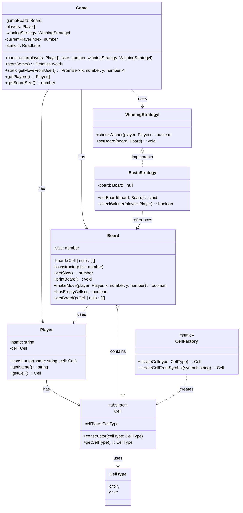

# Tic-Tac-Toe

A command-line implementation of the classic Tic-Tac-Toe game built with TypeScript using object-oriented programming principles and design patterns.

## 🎮 Features

- Classic 3x3 Tic-Tac-Toe gameplay
- Supports multiple players
- Customizable board size
- Extensible winning condition strategies
- Clean object-oriented architecture

## 📋 Requirements

### Functional Requirements

1. **Game Setup**

   - System shall allow two players to participate in a game
   - System shall assign unique symbols (X and Y) to each player
   - System shall initialize an empty board of configurable size (default 3x3)

2. **Gameplay**

   - System shall allow players to take turns making moves
   - System shall validate all move attempts and reject invalid moves
   - System shall display the current state of the board after each move
   - System shall alternate turns between players automatically

3. **Win Conditions**

   - System shall detect when a player has three of their symbols in a row horizontally
   - System shall detect when a player has three of their symbols in a row vertically
   - System shall detect when a player has three of their symbols in a row diagonally
   - System shall declare the appropriate player as winner when win conditions are met

4. **Game End**
   - System shall detect when the game board is full (draw condition)
   - System shall end the game when a win condition is met or draw is detected
   - System shall announce the game result (winner or draw)

### Non-Functional Requirements

1. **Usability**

   - The game shall provide clear prompts for user input
   - The game shall clearly display the board state in a readable format

2. **Extensibility**

   - The system shall be designed to allow future addition of new cell types
   - The system shall support custom winning condition strategies
   - The system shall be able to adapt to different board sizes

3. **Maintainability**

   - The codebase shall follow SOLID principles
   - The codebase shall implement appropriate design patterns
   - All components shall have clearly defined responsibilities

4. **Reliability**
   - The system shall handle invalid inputs gracefully without crashing
   - The system shall maintain game state consistency throughout gameplay

## 🏗️ Architecture

This implementation follows SOLID principles and incorporates several design patterns:

- **Factory Method Pattern**: Used for cell creation through `CellFactory`
- **Strategy Pattern**: Applied for winning condition checks with `WinningStrategyI` interface
- **Inheritance**: Cell hierarchy with abstract base class and concrete implementations

### Class Structure

- `Game`: Main controller that orchestrates game flow
- `Board`: Represents the game board and manages moves
- `Player`: Represents a player with name and cell type
- `Cell`: Abstract base class for different cell types (X and Y)
- `WinningStrategyI`: Strategy interface for checking win conditions

## Diagram



## 🛠️ Technology Stack

- TypeScript
- Node.js
- Jest (for testing)

## 📋 Prerequisites

- Node.js (v14.0.0 or higher)
- npm or yarn

## ⚙️ Installation

1. Clone the repository:

   ```bash
   git clone https://github.com/kashaf12/LLD-in-Typescript.git
   cd Tic-Tac-Toe
   ```

2. Install dependencies:

   ```bash
   npm install
   ```

3. Build the project:
   ```bash
   npm run build
   ```

## 🚀 Running the Game

Run the game with the following command:

```bash
npm run dev
```

Follow the prompts to play the game. Players take turns entering coordinates for their moves in the format `row col` (e.g., `1 2`).

## 🧪 Running Tests

Run the test suite with:

```bash
npm test
```

## 🧩 Code Examples

### Initializing the Game

```typescript
import { CellType } from "./Cell";
import { CellFactory } from "./CellFactory";
import { Game } from "./Game";
import { Player } from "./Player";

// Create players with X and Y cells
const playerXCell = CellFactory.createCell(CellType.X);
const playerYCell = CellFactory.createCell(CellType.Y);
const player1 = new Player("Player 1", playerXCell);
const player2 = new Player("Player 2", playerYCell);

// Initialize game with a 3x3 board
const game = new Game([player1, player2], 3);
game.startGame();
```

### Making a Move

```typescript
// Inside Game.startGame method
const { x, y } = await Game.getMoveFromUser();
this.gameBoard.makeMove(player, x, y);
```

## 🛣️ Future Enhancements

- Add AI opponent with different difficulty levels
- Implement game history and replay functionality
- Create a graphical user interface
- Add network play support
- Implement custom player symbols beyond X and Y

## 🧠 Learning Value

This project demonstrates:

- Proper OOP principles
- Implementation of design patterns
- TypeScript type safety
- Test-driven development
- Clean code practices

## 📜 License

MIT

## 👥 Contributing

Contributions are welcome! Please feel free to submit a Pull Request.

1. Fork the repository
2. Create your feature branch (`git checkout -b feature/amazing-feature`)
3. Commit your changes (`git commit -m 'Add some amazing feature'`)
4. Push to the branch (`git push origin feature/amazing-feature`)
5. Open a Pull Request
